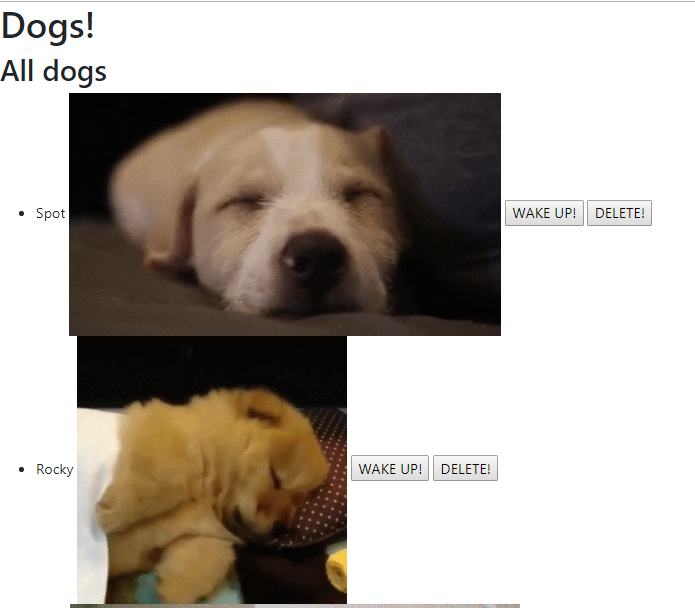
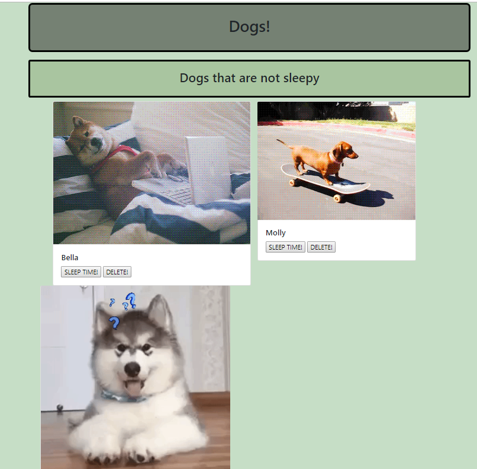

# dogs-app

## Presentation Slides
<a href="https://docs.google.com/presentation/d/1JD8qXCBsQB4RrjmVpcRj9VVzl0lWYzydTSoZLKXKIxM/edit?usp=sharing" target="_blank">Link to google slides</a>


## Description
This app is a basic fullstack app that uses MySQL and handlebars to show
sleepy and awake dogs. A form is used to add new dogs. A user can also
delete dogs.

There are several versions to this project as it is meant to reflect the
different stages of implementation.

## Installation
* `git clone git@github.com:f-flores/dogs-app.git`
* `cd dogs-app/version1`
* `npm install`
* Run the contents of `db/schema.sql` and `db/seeds.sql` in MySQL Workbench. This step creates the database and inserts seed data.
* Create a `.env` file with the following contents:

```
# environment variables

DB_USER="your_mysql_username"
DB_PASSWORD="your_mysql_password"
```

## Usage
### Version 01
From the root of the folder, change directory to `version01` by typing
in `cd version01` for a terminal.

Now, run the server by typing in `node ./server.js` and pressing enter.



### Version 02
Version 2 adds the /api/dogs post routes in `dogController.js`. It also improves
the handlebar layout by leveraging bootstrap classes. Some custome style classes
are added to `/assets/css/style.css`. The `Add Dog` form is functional (the ajax
post function is defined in `/assets/js/dog.js`).

From project root, change directory to `version02`. Run `npm install`. Then,
start the server by running `node ./server.js` and pressing enter.

* Bootstrap Grid Layout


* Add Dog Form


### Version 03
Version 3 of dogs-app completes the CRUD functions in `dogsController.js`.
`api/dogs/:id` delete route and `api/dogs/:id` update routes are added. On the
front end, in `dogs.js`, the corresponding ajax calls are defined. That is to
say, the `ajax` PUT and DELETE calls are made within the "update-state" and the
"delete-dog" functions.

Some more styling work is done in `public/assets/css/style.css`.

* Wake up Dog and Sleepy Dog


* Add Dog Form


* Delete Dog


## Comments
The file `createStructure.sh` does not need to be executed since all the
folders and files are already created. It is just there for studying purposes.
